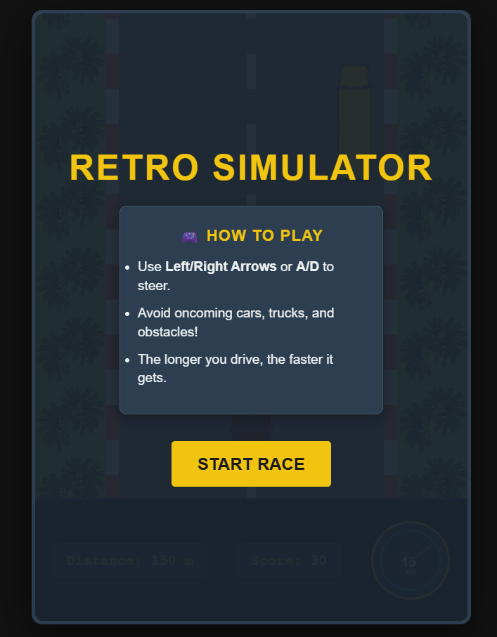
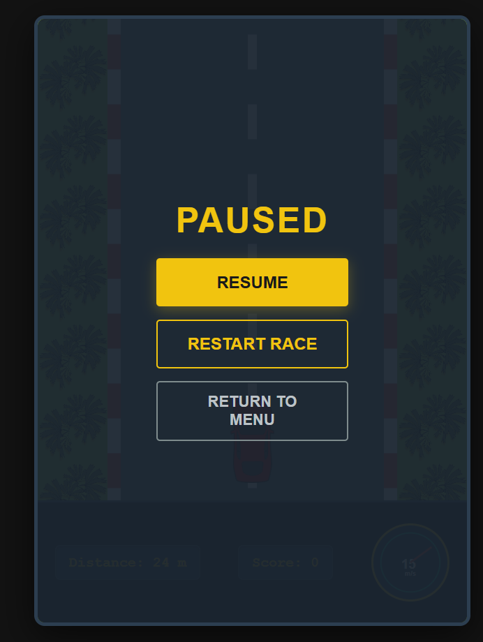

# Retro Highway Racer

An endless 2D highway racing game featuring an interactive dashboard console, smooth parallax environments, and responsive mechanics built entirely with vanilla frontend technologies.

## Features
- **Dynamic Speedometer:** An interactive SVG gauge that smoothly interpolates needle acceleration and deceleration using CSS transitions.
- **Parallax Environments:** Independent layered background scrolling logic where the grass textures move relative to the highway speed to simulate spatial depth.
- **Defensive Boundary Collision:** Accurate bounding-box detection handling collision limits against curbs and obstacle types.
- **Unified Arcade UI/UX:** A structured racing slate and gold console theme optimized across mobile, tablet, and desktop breakpoints.

## Technologies Used
- HTML
- CSS
- JavaScript

## How to Run
1. Open index.html in a web browser
2. Enjoy the project!

## Screenshots

| Main Menu | Gameplay |
| :---: | :---: |
|  |  |

| Paused Screen | Game Over |
| :---: | :---: |
|  |  |

## Author
Poorvi Parashar